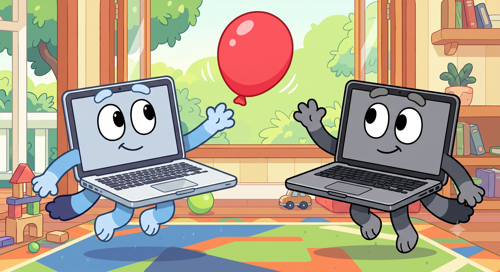

# Keepy Uppy



Keeps a Mac awake with the lid closed, so a long build, a remote session, or an
overnight job doesn't die when you shut the screen.

It is headless-first: a background daemon does the work, a command line drives
it over SSH, and the menu-bar app is optional. Sessions have an end condition —
a duration, a clock time, an app that's running — and every one of them is
bounded by safety guards that stop the Mac cooking itself unattended.

> **Status: early.** It works, it's signed and notarized, and it has 173 tests
> — but it has been in real use for hours, not weeks, on one machine. Read
> [Status and caveats](#status-and-caveats) before trusting it with anything
> that matters.

## Install

Download the notarized `.dmg` from [Releases](../../releases), drag the app to
`/Applications`, open it, and click **Enable Keepy Uppy** in Settings →
General. macOS will ask you to approve two background items once, in System
Settings → General → Login Items & Extensions. Nothing prompts after that.

For a headless machine that will never run the app:

```sh
"/Applications/Keepy Uppy.app/Contents/MacOS/keepy-uppy" setup
```

## Use it

From the menu bar: **Start…** picks a duration, the menu lists whatever is
currently keeping the Mac awake and why, and each entry can be stopped
individually.

From the command line — the same daemon, so this works fine over SSH:

```sh
keepy-uppy on                                  # until you say otherwise
keepy-uppy on --for 2h
keepy-uppy on --until 17:00
keepy-uppy on --while-app com.apple.dt.Xcode   # ends when Xcode quits
keepy-uppy off                                 # stop the sessions you started
keepy-uppy off --all                           # stop everyone's
keepy-uppy status --json                       # {"keepingAwake": true}
keepy-uppy sessions
keepy-uppy reset                               # unregister both services
```

The binary lives at `/Applications/Keepy Uppy.app/Contents/MacOS/keepy-uppy`;
symlink it onto your `PATH` if you want the short form above.

A session started from the CLI outlives the shell that started it. One started
from the menu bar ends when you quit the app — that's the difference between
"detached" and "client-bound", and it is deliberate.

## Safety

The daemon refuses to keep a Mac awake indefinitely no matter what you ask it
for. Configurable in Settings → Safety:

- **Overheating** — stops sessions once the Mac is throttling. Thresholds are
  tighter with the lid closed, where it can't cool itself as well.
- **Battery** — stops sessions below a percentage you choose, again tighter
  with the lid shut.
- **Maximum length** — a backstop for a session you started and forgot.

When a guard fires it also suppresses *automatic* restarts for a cooldown, so
a trigger can't fight the guard in a loop. Manual starts are always honoured —
overriding a guard is your call to make, but it should be a decision, not an
accident.

The governing rule is **no session outlives its evidence**: a timed session
ends on its clock, a condition-based one ends when the condition does *or when
the process observing it disappears*, and an indefinite one is capped by the
backstop. The daemon also forces sleep back on at its own startup and if the
app is deleted, so a crash can't leave the Mac silently awake.

## How it works

Four executables, split by privilege:

| | runs as | does |
|---|---|---|
| `KeepyUppyHelper` | root `LaunchDaemon` | owns the sleep setting; enforces every guard |
| `KeepyUppyAgent` | per-user `LaunchAgent` | watches what only a login session can see |
| `keepy-uppy` | you | the command line |
| `Keepy Uppy.app` | you | optional menu bar UI |

Only the daemon touches power state. Everything else asks it to, over XPC.

**The XPC boundary is the security design**, and it's the part worth reading
the code for. Each client role gets its own Mach service, and each service
pins a code-signing requirement admitting exactly one bundle identifier. So a
caller's role isn't asserted by the caller and isn't looked up from its PID —
which would be a TOCTOU race, since a PID can be recycled between accepting a
connection and inspecting it. It falls out of *which service accepted the
connection*, which the OS decided atomically at accept time.

Client identity is derived the same way: `"<role>-<uid>"`, from the accepting
listener plus the peer's authenticated uid. Both are facts the daemon knows
and the client cannot influence, which is what makes `keepy-uppy off` able to
stop a session an earlier `keepy-uppy on` started while still refusing to
touch another client's or another user's.

The session and safety engines are pure reducers — `(state, event, now) →
state` — with time injected rather than read. That's why an eight-hour session
can be tested in a millisecond, and why most of this project's logic is
covered by unit tests despite living inside a root daemon.

Design rationale, including the alternatives rejected and why, is in
[`docs/superpowers/specs/2026-08-06-keepy-uppy-v2-headless-design.md`](docs/superpowers/specs/2026-08-06-keepy-uppy-v2-headless-design.md).

## Build from source

```sh
brew install xcodegen just
just test     # 173 unit tests
just run      # build Debug and launch
```

A Debug build **cannot** talk to the daemon: code-signing enforcement is
compiled out, and the daemon refuses unauthenticated connections rather than
silently accepting them. To exercise the real thing you need a Developer ID
certificate:

```sh
export KEEPY_UPPY_SIGNING_IDENTITY="Developer ID Application: Your Name (TEAMID)"
export KEEPY_UPPY_TEAM_ID="TEAMID"
export KEEPY_UPPY_NOTARY_PROFILE="your-notarytool-profile"
just notarize   # signed, notarized, stapled .dmg in build/
```

## Status and caveats

Honest accounting, because this is a root daemon and you should know what
you're installing:

- **Verified end to end on one machine, briefly.** The full chain — daemon
  spawning under launchd, the signed XPC boundary, sleep actually being held
  off and released, a trigger starting and ending a session — has been
  confirmed working on a real notarized build. It has not been lived with for
  days, across reboots, or on more than one Mac.
- **Closed-lid behaviour is not hardware-verified.** The daemon demonstrably
  sets and clears the underlying `SleepDisabled` setting, which is the
  mechanism, but "my MacBook stayed awake through an 8-hour build with the lid
  shut" has not been observed.
- **The thermal and battery guards have not been observed firing on real
  hardware.** Their logic is unit-tested against injected inputs; the
  observers that feed them are not.
- **Multi-user Macs are lightly considered.** Sessions and agent evidence are
  scoped per uid, but fast user switching is untested, and safety config is
  read from whichever user's agent is connected.
- Remaining manual checks are listed in
  [`docs/manual-test-checklist.md`](docs/manual-test-checklist.md).

If you find something, an issue with the daemon log (`log show --predicate
'subsystem BEGINSWITH "au.com.workwireless.keepy-uppy"'`) is genuinely useful.

## License

MIT — see [LICENSE](LICENSE).
